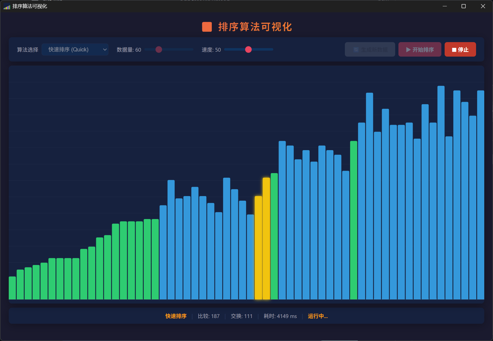

<div align="center">
  <h1>📊 排序算法可视化</h1>
  <p>
    <strong>基于 Tauri 的桌面端排序的7 种经典排序算法可视化工具。</strong>
  </p>
  <p>
    该项目完全基于opencode+omo生成，是个人AI编程的试水作，提示词为"用Tauri实现一个win应用程序，用来可视化几种排序算法，要求可以选择多种算法，且可以设置演示速度，要求结果以.exe呈现"
  </p>
</div>

<br>

<div align="center">
  
</div>

<br>

## ✨ 功能特性

| | |
|---|---|
| **7 种算法** | 冒泡 · 选择 · 插入 · 归并 · 快速 · 堆 · 希尔 |
| **实时统计** | 比较次数、交换次数、运行时间即时显示 |
| **速度调节** | 滑块从 1（慢速）到 100（瞬间） |
| **数据规模** | 10–200 条，一键随机生成 |
| **颜色标记** | 🟡 比较中 · 🔴 交换中 · 🟢 已排序 |
| **深色主题** | 护眼暗色调界面 |
| **跨平台** | Windows / macOS / Linux（Tauri 支持） |

<br>

## 🚀 快速开始

### Windows 用户

从 [Releases](https://github.com/your-username/sorting-visualizer/releases) 下载最新 `.exe`，双击运行即可，无需安装。

### 从源码构建（Linux/WSL）

```bash
git clone https://github.com/your-username/sorting-visualizer.git
cd sorting-visualizer
./build-wsl.sh
```

构建脚本自动完成：
1. 下载 MinGW 交叉编译工具链（本地解压，无需 root 权限）
2. 配置 Rust 的 `rust-lld` 作为 Windows PE 链接器
3. 编译前端 + 交叉编译 Rust 后端
4. 输出 `sorting-visualizer.exe` 到 `dist-win/` 目录

> 产物为独立 `.exe`，无需额外运行时，拷贝到任意 Windows 机器即可运行。

<br>

## 🧠 支持的算法

| 算法 | 复杂度 | 说明 |
|------|--------|------|
| **冒泡排序** | O(n²) | 重复遍历数组，比较相邻元素并交换 |
| **选择排序** | O(n²) | 每次从未排序部分选出最小元素放到已排序末尾 |
| **插入排序** | O(n²) | 逐个将元素插入到已排序部分的正确位置 |
| **归并排序** | O(n log n) | 分治法：分割数组 → 递归排序 → 合并 |
| **快速排序** | O(n log n) | 分治法：选取基准值，分区后递归 |
| **堆排序** | O(n log n) | 构建最大堆，反复提取堆顶元素 |
| **希尔排序** | O(n log n) | 改进的插入排序，允许交换远距离元素 |

<br>

## 🏗 技术架构

```
┌─────────────────────────────────────┐
│  Tauri v2                           │
│  ┌───────────────────────────────┐  │
│  │  WebView2 (Chromium 引擎)      │  │
│  │  ├── HTML / CSS（界面布局）    │  │
│  │  ├── Canvas   （柱状图渲染）   │  │
│  │  └── TypeScript（算法逻辑）    │  │
│  └───────────────────────────────┘  │
│  ┌───────────────────────────────┐  │
│  │  Rust（Tauri 主进程）          │  │
│  └───────────────────────────────┘  │
└─────────────────────────────────────┘
```

- **前端**: TypeScript + Vite + Canvas API
- **后端**: Rust + Tauri v2
- **构建**: Linux → Windows 交叉编译（MinGW + rust-lld）
- **运行时**: WebView2（Windows 10+ 自带）

<br>

## 🛠 本地开发

```bash
# 安装依赖
npm install

# 开发模式（热重载）
npm run tauri dev

# 构建原生 Linux 版本
npm run tauri build

# 交叉编译 Windows .exe（Linux/WSL 下）
./build-wsl.sh
```

<br>

## 📁 项目结构

```
sorting-visualizer/
├── build-wsl.sh                # 一键交叉编译脚本
├── dist-win/                   # 编译产物（.exe）
├── index.html                  # 入口 HTML
├── src/
│   ├── main.ts                 # 应用入口
│   ├── controller.ts           # 状态管理 + 事件绑定
│   ├── styles.css              # 深色主题样式
│   ├── types.ts                # 类型定义
│   └── sorting/
│       ├── algorithms.ts       # 7 种排序算法实现
│       └── visualizer.ts       # Canvas 渲染引擎
├── src-tauri/
│   ├── Cargo.toml              # Rust 依赖
│   ├── tauri.conf.json         # Tauri 配置
│   ├── src/main.rs             # Windows 入口
│   ├── src/lib.rs              # Tauri 启动
│   └── icons/                  # 应用图标
├── package.json
├── vite.config.ts
└── tsconfig.json
```

<br>

## 📜 开源协议

MIT
